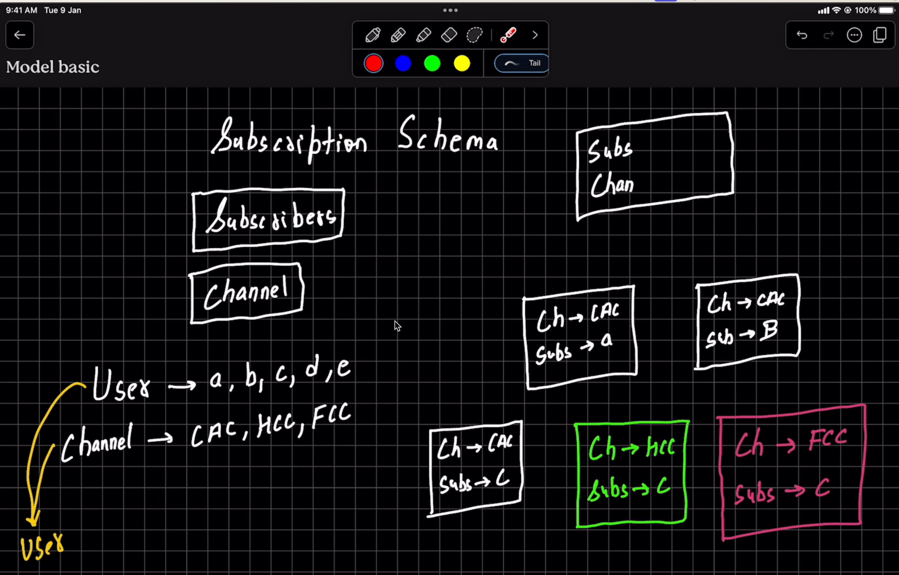

## when we have to find the channel from the subcription model then we find ki kitne document me user subcribed hai tab ham usko match kr ke find kar sakte hai user ne kin kin channel ko subscribe kiya hai aur uske hisab se channel ko find kar sakte hai.

# and when we have to find ki hamare pass kitne subcriber hai to ham subcription model me jaa ke find karnge ki kitne channel ko hamne subcribe kiya hai ya kitne document ke channel same hai then we just count ki hamare pass kitne doucment hai that is the subcriber count 

<!-- ## Finding channels from the subscription model

When we need to find the channels a user has subscribed to, we query the subscription model for documents associated with that user. We can then match those documents with the channel collection to find the channels the user has subscribed to.
b
# Finding the subscriber count

To find how many subscribers a channel has, we query the subscription model for documents whose channel matches that channel. The number of matching documents is the subscriber count. -->

