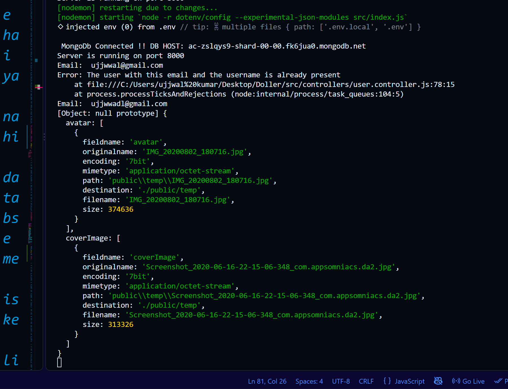
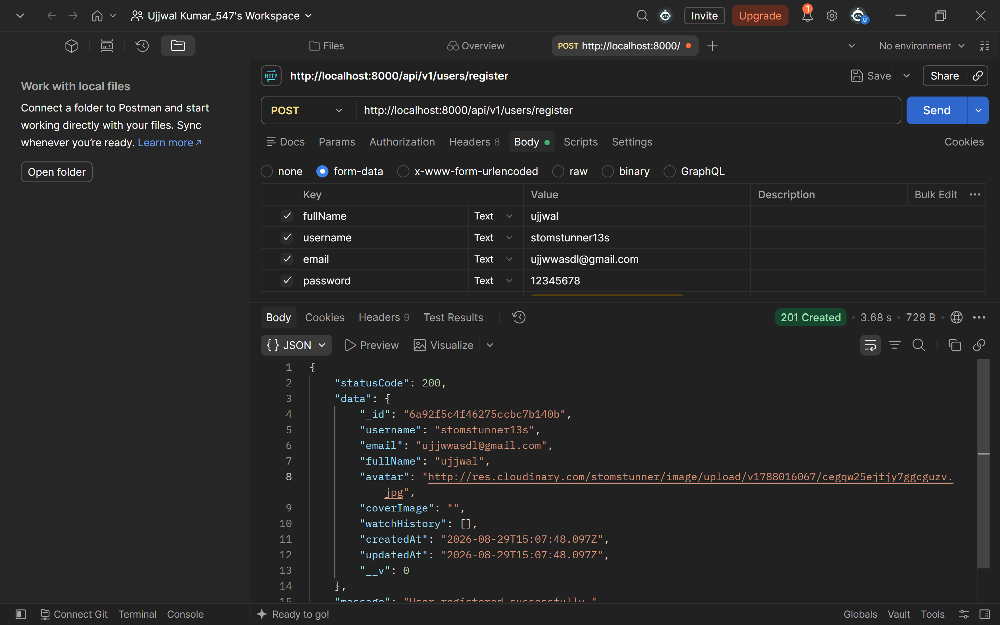
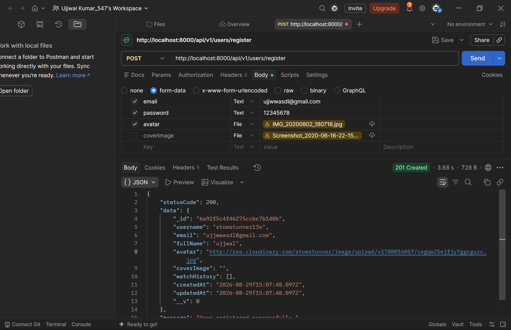
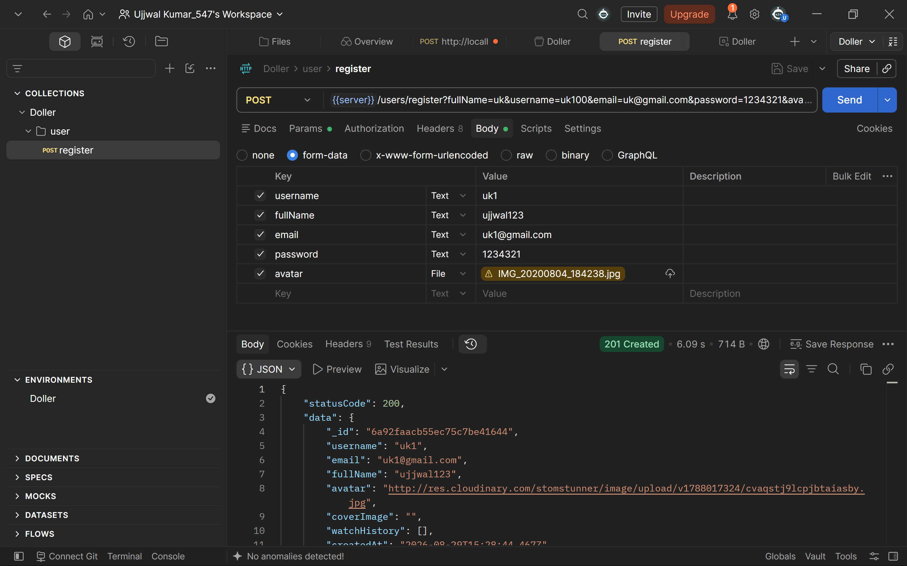

## here we use cloudniery for storing the videos and images on the servers 
`npm i cloudinary`

---

## after installing the cloudinery we install the multer 
`npm i multer `

----

if we talk about the file upload we first take the file and upload or save to the local storage with the help of the multer jisse ham usko baad me cloudinary per upload kar sakte hai 

## in the cloudinary request.files response kya aata hai




## now we can give the data without the coverimage




```js
let coverImageLocalPath;
    if( req.files && Array.isArray(req.files.coverImage) && req.files.coverImage.length > 0 ){
        // now we know ki hamre pass cover image hai hi hai

        coverImageLocalPath = req.files.coverImage[0].path
    }
```


## working postamn
