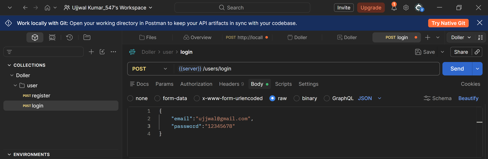
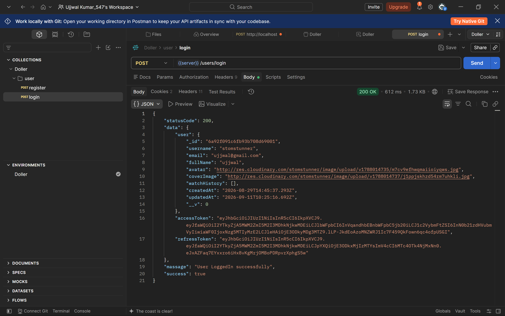

## here we test the user cranditials ki user login hai toh uska data like refress token aur access token aur user ka data store karna hai local storage me aur agar user login nahi hai toh usko login page pe redirect karna hai

## hame wohi username aur uska email ya password dalna hai jo hamane register karte time postman pe dala tha

