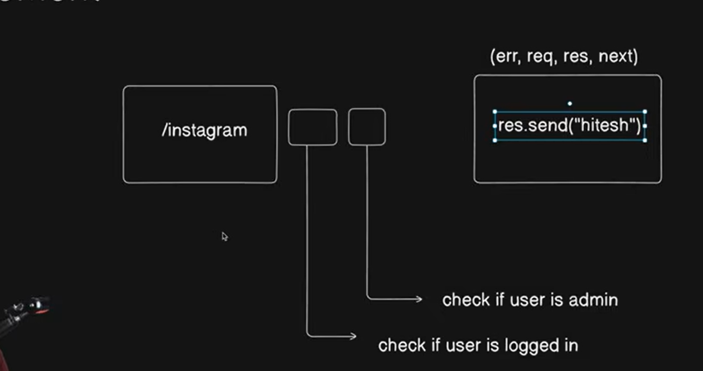

## first of all create a folder

## then write this command

`npm init`

- node package manager initilization

## then just make package name and do the some setup

---

## after making the public folder and temp folders

---

## we make a `.env` file jisme hamra sara api keys hoga

---

## then we make a src folder on the root

---

## for creating a empty file from the cmd

C:\Users\ujjwal kumar\Desktop\Doller\src> `type null > constant.js`

---

## now we install the `nodemon`

jisse hamara har baar code ko woh watch karta hai aur auto reload karte hai

- ham isko as a development tool use karnge jisse hamre deployment me use na ho

`npm i --save-dev nodemon`

## now we just have to go to the package,json file aur usne ander script me dev key me hamara nodemon and apne file ka naam aur source dena hai jisse jab bhi npm run dev command chayenge then hamra nodemon ki help se woh index.js file baar baar reload hoga

---

## now in the big company the commas and the spaces are important when we push to the github so pritteier ka hona bahut jaruri hai toh uske liye ham dev dependencies me priterrier ko install akr lete hai

` npm i -D prettier`
# although we do it here

## make a file .prettierrc
for configuration of prettier

---
so in the environment varibale we have to write our username and password and remove the ending slash

---

after that we name of the database 
- go to the src 
---

now we install the mongoose dotenv and express

----

now we install the cookie-parser and cors

---

so if we talk about the middlewares 
## middlewares
It is a kind of function between the url and request response 
before sending the response we check ki user logged in hai ya nahi ya user admin toh nahi hai someting like this 

- also there is 4 elements in the request response 1st one is error that just send the error and 2nd one is request = when the user request for some service from the server and the 3ed one is the response = server send the data to the user and the last one is the next = it is just a flag ki hamara middle wale complete ho gaya hai toh next middleware pe jane ke liye hai usko use karte hai bina next ke mark hue ham 1 middleware se dusre middleware pe nahi jaa sakte hai 

---

## so we will talk to the database many time and every time we have to write the async await and try catch method for that that is a lengthy process because we will talk to the database many times 

- thats why we will make the utilities in the utilities where we just give the arguments and it will gives us a response 

---

## after making the utils  where we make the api response file for centralized and standerdized response and standerdized api error and asynce handler that jsut takes the fucntion gies us a response for taking to the database

--- 

now we make the models where store the realtionship with the videos 

--- 

after making the models we use the bcrypt and jwt (json web token) for bcrypt = for password encryption and decription alorithm and makes it secreate and jwt for token refress tokens

--- 

now we go to the user file and write the bcrpt and jwt importing